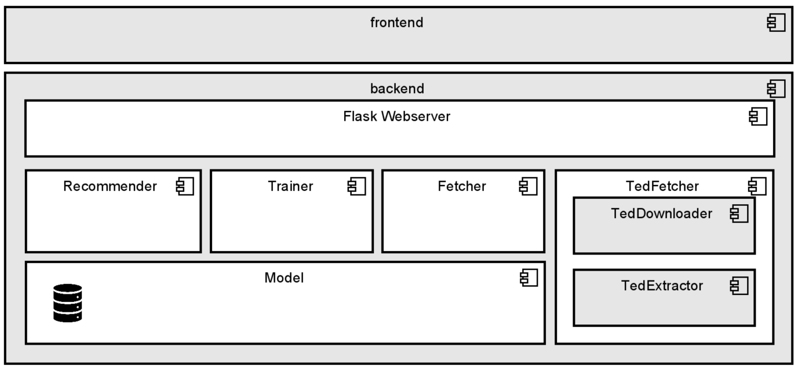
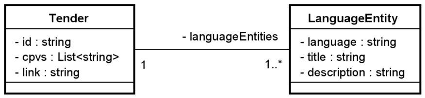
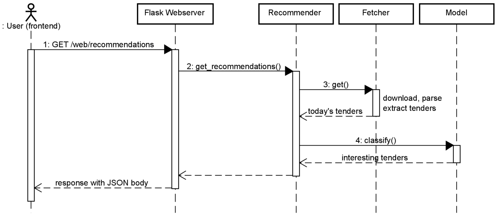
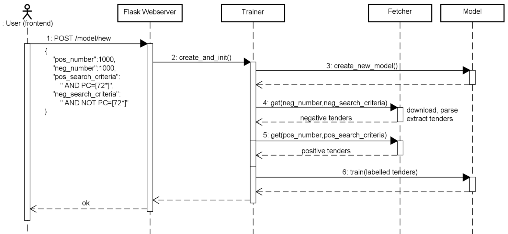
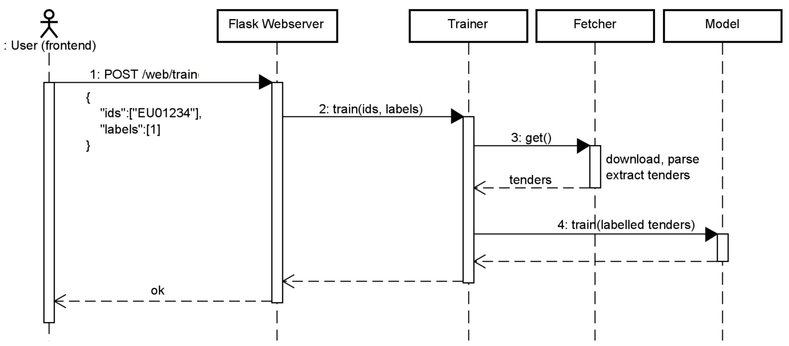
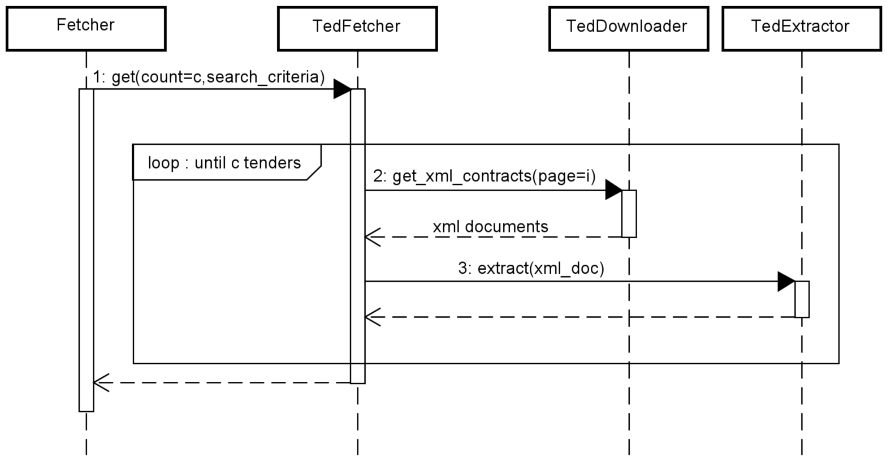

# tuwien-inso-bachelorthesis-tenderclass-backend

tenderclass is an automated screening system for public procurement notices using state-of-the-art Machine Learning and Natural Language Processing (NLP) frameworks. This git repository holds the Python-based backend of tenderclass. It is responsible for downloading, parsing and classifying tenders from Tenders Electronic Daily (TED). For this reason, this prototype implements two Machine Learning approaches:

- SpacyScikitModel: Machine Learning Model based on [spaCy](https://spacy.io/) and [scikit-learn](https://scikit-learn.org/stable/)
- TransformerModel: Machine Learning Model based on [Hugging Face](https://github.com/huggingface/transformers) and [simpletransformers](https://github.com/ThilinaRajapakse/simpletransformers)

## Getting Started

These instructions will get you a copy of the project up and running on your local machine for development and testing purposes. See deployment for notes on how to deploy the project on a live system.

### Prerequisites

What things you need to install the software and how to install them

- [Python 3.7/3.8](https://www.python.org/downloads/)
- OPTIONAL: If you want to train the TransformerModel on a Nvidia GPU (much faster!): [CUDA Toolkit 10.2](https://developer.nvidia.com/cuda-downloads)
- OPTIONAL: If you want to deploy it to a hyperscaler cluster: [Docker]() runtime environment

### Installing

1. Clone this repository into your directory of choice.
`$ git clone https://github.com/ngriebenow/tuwien-inso-bachelorthesis-tenderclass-backend`

2. Navigate to the root directory `tenderclass-backend`.
`$ cd tenderclass-backend`

3. OPTIONAL: If you want to use a virtual environment, run the following steps:
- Install the `virtualenv` package.
`$ pip install virtualenv`
- Create a new folder for the virtual environment.
`$ mkdir venv`
- Initialize the virtual environment.
`$ virtualenv venv`
- Activate the virtual environment.
Run on Windows: `$ venv\Scripts\activate.bat`
Run on Linux: `$ source venv/bin/activate`

3. Install all the required dependecies using Python packet manager `pip`.
`$ pip install -r requirements.txt`

4. Install the spaCy german language model.
`$ python -m spacy download de`

5. Navigate to the `src` directory and start the web server by running `main.py`.
`$ cd src`
`$ python main.py`

6. OPTIONAL: Deactive the virtual environment:
Run on Windows: `$ venv\Scripts\deactivate.bat`
Run on Linux: `$ source venv/bin/deactivate`

## Deployment

You can deploy the backend of tenderclass by using a Docker container.

1. Clone this repository into your directory of choice.
`$ git clone https://github.com/ngriebenow/tuwien-inso-bachelorthesis-tenderclass-backend`

2. Navigate to the root directory `tenderclass-backend`.
`$ cd tenderclass-backend`

3. Build the Docker container.
`docker build -t="tenderclass-backend" .`

TODO

## API Endpoints
Documentation for the API Endpoints is available in Swagger UI. After starting the web server, enter the following web site into your browser:
[API Documenation](http://localhost:5000/static/swagger.json)

## Architecture
The back end incorporates the business logic and Machine Learning services including its persistence. By means of Flask, which is a Python package for enabling socket-based endpoints, the back end system makes all its services available via a Representational State Transfer (REST) API. It consists of the following components:
- Recommender: This component firstly downloads all tenders published on the current date using the Fetcher component. After classifying those tenders by means of the Machine Learning model, it only returns those tenders which are interesting.
- Trainer: This module trains the model by fetching two tender sets (positive tenders and negative tenders), labeling them and then feeding them to the model. It also allows to reset the model.
- Fetcher: This class is responsible for downloading tenders from the internet. Although it only delegates the request to the TedFetcher, there is the possibility that tenderclass could also address other public procurement data sources next to TED. This component would decide which data source should be used.
- TedFetcher: Given a number and a search query, this component automatically downloads the raw XML tender data using the TedDownloader. Afterwards, it delegates the XML document to TedExtractor, which builds up the Tender entity by extracting the relevant fields from the XML document.

### Data model
The prototype tenderclass implements two types of entities. A Tender represents one single public procurement notice. It holds the unique identifier of type string, which is assigned externally by TED, the hyperlink to the official TED website document of type string as well as the
list of CPV codes of type list of strings. Moreover, each tender consists of an array of at least one LanguageEntity. This entity holds the language-specific information such as title of type string and description of type string. Although requirement analysis only dictates to support German public procurement notices, the data model already supports multiple languages in case of extending the prototype with additional features such as multi-language or translation support. The following figure shows the corresponding class diagram of the data model.

## Endpoints and Program Flow

### Get recommendations
This endpoint downloads all tenders published on the current date, classifies them and then only returns the positive tenders as recommendation. The following figure depicts the communication flow. After receiving the request, firstly the Flask web server delegates it to the Recommender module. This component uses the Fetcher module for downloading and parsing the tenders. The Fetch Model section displays its sequence communication in more detail. Subsequently, the Recommender module only returns those tenders the model has classified to be interesting.

### Create new model
This endpoint creates a new model and trains it with two distinct sets of tenders. For this purpose, the JSON body requires four different properties. The pos_number attribute indicates how many positive tenders the application should download from TED and feed to the model. Thereby, the pos_search_criteria specifies the constraints each positive tender must fulfill. In this case, at least one CPV code must start with 72. Analogously, the same procedure applies for the negative tenders. The following figure illustrates the communication flow. After receiving the request from the Flask web server, the Trainer component firstly creates a new model. Secondly, it fetches both sets of positive and negative tenders respectively. With the tenders wrapped to tuples together with their corresponding labels (1 for positive, 0 for negative), the Trainer module randomly shuffles the tuples. The reason is that otherwise, the model would firstly be trained with the series of positive tenders and afterwards with the series of negative tenders. To counteract this imbalance, the following train call receives the shuffled list of labeled tenders.

### Train from web
This endpoint updates the model with additional labeled training data. As the user should have the possibility to either confirm or reject the recommendations, this endpoint fits the model with feedback data. For that reason, the Flask web server accepts a JSON body with two properties. The ids property is a JSON list of tender identifiers which tenderclass automatically downloads. The  labels property is an integer list which gives the corresponding labels for these tenders. The i-th label belongs to the i-th id. This is why both lists must be of the same length. Similar to the get recommendations endpoint in the previous section, Flask delegates the request to another component, but this time to the Trainer. The following figure outlines the communication flow. As this module only knows the ids, but not the actual tender data, it first of all needs to download the entire tender metadata. This is why it builds up a search criteria query in the way that the tender id must equal to at least one id in the list. After passing this search criteria to the Fetcher, it receives all tender entities that have been found. As a second step, the Trainer module maps the downloaded tenders to the given labels before wrapping them to tuples. By passing them to the train method, the Model component feeds those labeled tenders to its internal classification model. Finally, the flask web server returns with ok.

### Fetch models
Although there is no designated endpoint for fetching specific, query-based tenders, each core function requires downloading, parsing and extracting tenders which the Fetcher module is responsible for. This is why this subsection explains in detail the communication flow of fetching a tender, as seen in the following figure. As soon as the Fetcher module gets a request, it immediately delegates the request to the TedFetcher. In defiance of this extra delegation, this pattern allows developers to add additional data sources such as national public procurement platforms. As TED API supports pagination with up to 100 tender documents per API call, the TedFetcher needs to enter a loop. In each iteration, it calls get_xml_contracts with i as the page number. Subsequently, the triggered TedDownloader issues a REST call to the TED API as described in the Fetch Tender section. Once it has parsed the response and returned the list of XML documents of the i-th page, the TedFetcher module calls the extract method from the TedExtractor. This second step instantiates and initializes a new Tender entity by extracting CPV code, id, title and description out of the XML document. As soon as the component either reaches the requested number c of tenders or exceeds the maximum number of pages (which implies that fewer tenders than intended are returned), the module returns the list of Tender entities.

## Authors

* **Nicolas Griebenow** - *Initial work* - [ngriebenow](https://github.com/ngriebenow)

